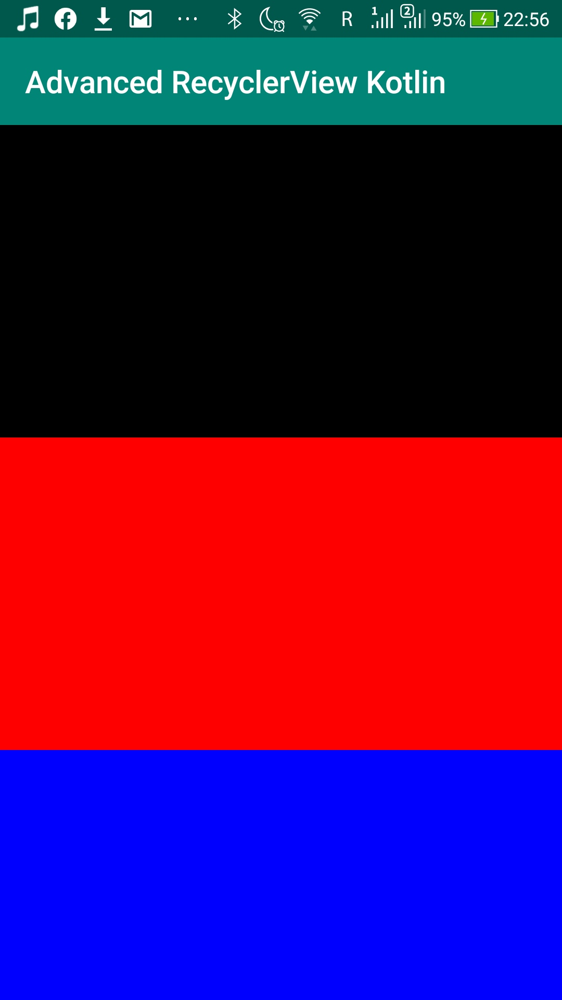
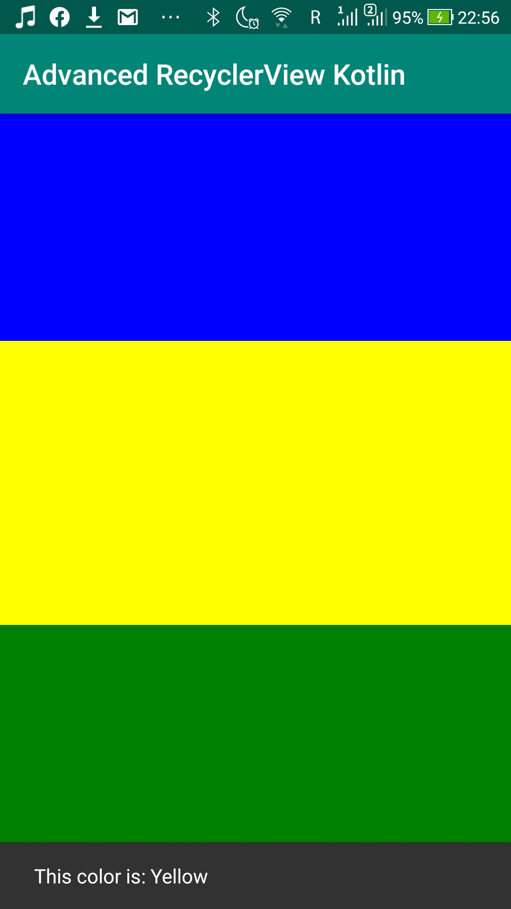

# Level 6 Learning Task 1 - Advanced RecyclerView Kotlin
This is an app where a recyclerview of coloured images is displayed from the web. When an image is clicked then the name of the color is displayed in a snackbar message. 
## What's inside
The following new subjects were covered in this learning task:
* Adding a click listener for each item in a recyclerview.
* Using Glide to display images from the web.
## Screenshots
    

